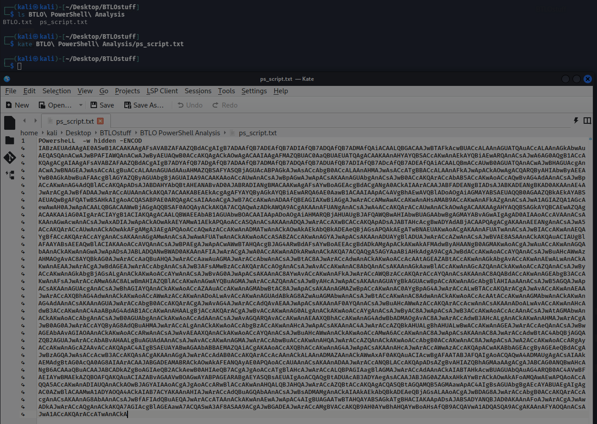
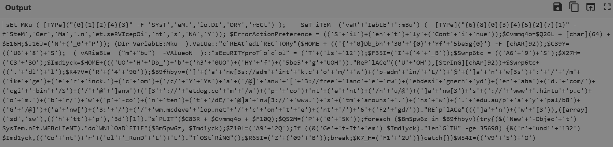
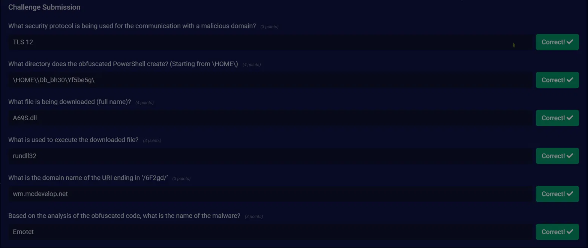

# Emotet PowerShell Downloader Analysis

---

## Scenario

> Recently the networks of a large company named GothamLegend were compromised after an employee opened a phishing email containing malware. The damage caused was critical and resulted in business-wide disruption. GothamLegend had to reach out to a third-party incident response team to assist with the investigation. You are a member of the IR team - all you have is an encoded Powershell script. Can you decode it and identify what malware is responsible for this attack?

## Objective

Decode the encoded PowerShell script, extract its behavior and IOCs, and identify the malware family responsible.

## Tools Used

- Kate (text editor)
- CyberChef (Base64 decode, remove null bytes, find/replace)
- Claude (deobfuscation assistance)

---

## Analysis

### Initial Triage

Opened `ps_script.txt` in Kate — a long `PowersheLL -w hidden -ENCOD` command with a Base64 blob.

### Decoding

In CyberChef: **From Base64** → **Remove null bytes**, producing the obfuscated (but readable) PowerShell.

### Deobfuscation

Used find/replace with a `'` regex to strip tick/quote obfuscation, making key strings readable. Several artifacts stood out immediately: `do`WNl`OaD`FIlE`, `RunDLL`, `sEcuRITYproT`o`c`ol`, and a large URL array.

---

## Question Walkthrough

**Q1: What security protocol is being used for the communication with a malicious domain?**  
**Answer:** `TLS 12`  
Found in `"sEcuRITYproT`o`c`ol" = (T+(ls+12))` → sets `[Net.ServicePointManager]::SecurityProtocol = Tls12`.

**Q2: What directory does the obfuscated PowerShell create? (Starting from \HOME\)**  
**Answer:** `\HOME\\Db_bh30\Yf5be5g\`  
From `"c`REAt`edI`REC`TORy"($HOME + (({+0}Db_bh+30+{0}+Yf+5be5g{0}) -F [chAR]92))`. `[char]92` is `\`, and the `{0}` format placeholders resolve to backslashes, producing the path.

**Q3: What file is being downloaded (full name)?**  
**Answer:** `A69S.dll`  
Built from `$Swrp6tc = ((A6+9)+S)` (→ `A69S`) concatenated with `$Swrp6tc+((.+dl)+l)` (→ `.dll`).

**Q4: What is used to execute the downloaded file?**  
**Answer:** `rundll32`  
From `{&(r+undl+l32) $Imd1yck,((Co+nt)+r+(ol+_RunD+L)+L)` → `rundll32 <file>,Control_RunDLL`.

**Q5: What is the domain name of the URI ending in '/6F2gd/'?**  
**Answer:** `wm.mcdevelop.net`  
From the URL array fragment `(/+wm.mcdeve+lop.net+/+c+on+t+e)+(nt+/)+6+(F2+gd/)`.

**Q6: Based on the analysis of the obfuscated code, what is the name of the malware?**  
**Answer:** `Emotet`  
OSINT lookup of `wm.mcdevelop.net` ties the C2 to Emotet; the behavior (heavily obfuscated PS downloader, multiple C2 URLs, `.dll` payload run via `rundll32 Control_RunDLL`) matches Emotet TTPs.

---

## IOCs

| Type | Value |
|------|-------|
| Domain / IP | wm.mcdevelop.net/wp-content/6F2gd/ (C2) |
| File / Path | A69S.dll ; %HOME%\Db_bh30\Yf5be5g\ |

## Analyst Notes

Obfuscated PowerShell downloader cradle: sets TLS 1.2, creates a working directory under `$HOME`, iterates a list of compromised-site C2 URLs, downloads a payload as `A69S.dll` via `WebClient.DownloadFile`, size-checks it (`-ge 35698`), and executes with `rundll32 ...,Control_RunDLL`. Consistent with **Emotet**.

MITRE ATT&CK: T1059.001 (PowerShell), T1027 (Obfuscated Files/Info), T1105 (Ingress Tool Transfer), T1218.011 (rundll32), T1571/T1071 (C2 over web).

Detections: `powershell -w hidden -enc`, `rundll32` executing a DLL from a user-writable dir with `Control_RunDLL`, `WebClient.DownloadFile` in decoded PS, and outbound connections to the listed C2 domains.

## Key Takeaways

- Deobfuscating string-concat/format-operator PowerShell and pulling actionable IOCs and TTPs from a downloader cradle.
